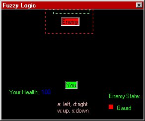



## AI: Fuzzy Logic

### Description

Do you want to know how Games like Quake, Diablo, Half-Life, Starcraft, Warcraft and many other Popular games of today make AI? Using Fuzzy Logic! And now, with this tutorial, You can use Fuzzy Lgoic too!
 
### More Info
 

             |
---                |---
**Submitted On**   |2000-08-25 21:34:12
**By**             |[L124RD](https://github.com/Planet-Source-Code/PSCIndex/blob/master/ByAuthor/l124rd.md)
**Level**          |Intermediate
**User Rating**    |3.6 (43 globes from 12 users)
**Compatibility**  |VB 6\.0
**Category**       |[Games](https://github.com/Planet-Source-Code/PSCIndex/blob/master/ByCategory/games__1-38.md)
**World**          |[Visual Basic](https://github.com/Planet-Source-Code/PSCIndex/blob/master/ByWorld/visual-basic.md)
**Archive File**   |[CODE\_UPLOAD93208262000\.zip](https://github.com/Planet-Source-Code/l124rd-ai-fuzzy-logic__1-10948/archive/master.zip)

### Source Code

<h1>AI: FUZZY LOGIC</H1>

<h4>Version History</h4>

·8/25/00 -- Update:

     Uses keys 'awsd' instead of buttons

     Scale mode now in pixels

     Attack mode accually works!

·8/23/00 -- First Version

<h4>It is Recommened that you </h4>

·Have read the AI:Case Logic Tutorial

·Have at least 1 year experiance in VB

<h3>Introduction to Fuzzy Logic</h3>

You all probobly Saw my Tutorial on Case Logic. Well the That used 'If X then Z'. But that my friend isn't how the Real brain works. It uses desicions to map out what its going to do, like probobility.

Today's Professional Game Coders don't use the simple Case Logic idea. Instead they use an idea known as 'Fuzzy Logic'.

 Fuzzy logic works along the lines of how there aren't just 1's and 0's but many numbers like 0.38492 not just 1 and 0. This tutorial shows you how to get going in Fuzzy Logic. As Fuzzy logic is Probobility to run the program we used probobility... even though they are rounded numbers.

<h3>FrmFuzzy</h3>

frmFuzzy has 2 shapes(red is the AGRESSIVE area and green is the goal), 7 labels(1 and 2 are the enemy and you), and 2 timers

<h4>Form_KeyPress</h4>

The Keypress stuff just does stuff when keys are pressed!

<h4>The Buttons</h4>

The buttons simply control the movement of Label1(you) using label1.left/label1.top. Pretty simple

<h4>The Timers</h4>

Every second one of the timers has the enemy make a desicion. each time it does the color of the dot on the upperright of the 'right' button changes color. and you see the state on the bottom right of the form. I will explain the calculate function in a minute

Every 1/2 second the other timer makes the moves for the enemy, checks if you've won/lost, and and does your hps. its pretty simple as well.

<h3>BasAI</h3>

 BasAI Holds all of the Globals and The Calculate Function for the game

<h4>The Globals</h4>

There are 3 states. Sleep, gaurd, and attack. The Probobility these have are stored in the variable of the same name.

Then there is the accual state. this holds the current state to be put in the label with the state, and for the timer to use

Then there is the hp wich gets minused when you come in contact with the enemy

<h4>Calculate Function</h4>

This Function is kinda simple.

First it creates a variable to be used to hold the total value of all the numbers

Then it adds up the values and adds one

Then it creates a variable to hold the random number in

I'll explain Each part of this line 'prob = CInt(rnd(time) * num)

the CInt Rounds the rnd(time * num so that it can be stored in an integer

The Rnd creates a random number from a seed. the time provides that seed so that the random number is a TRUE random number. Next it multiplies it by num so that it is not just between 1 and 0. we added the 1 in num so that it would be between 0 and num.

Then we set the state based on the value

If state is nothing we redo Calculate

and then we set the state label to the state

<h3>One Step Further</h3>

Most AI's for games are fuzzy logic, though not a very simple one like this. instead of the 30 someodd this program probobly was they use thousands of lines of code for something like this! Well hey, how do you think they got the job?

<h5>Code On</h5>

<h4>Da L124RD</h4>

